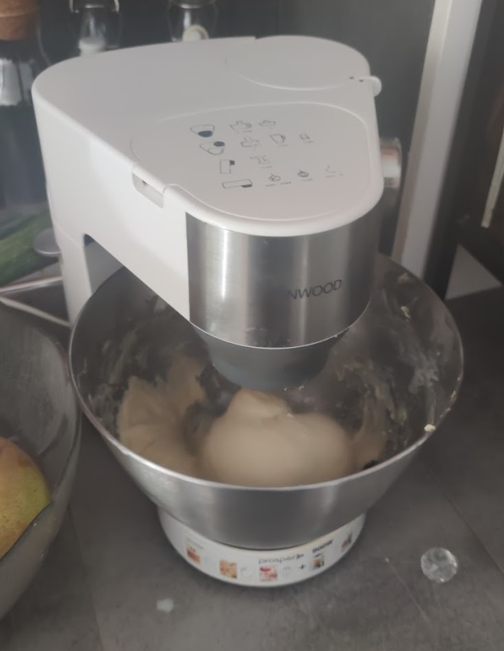
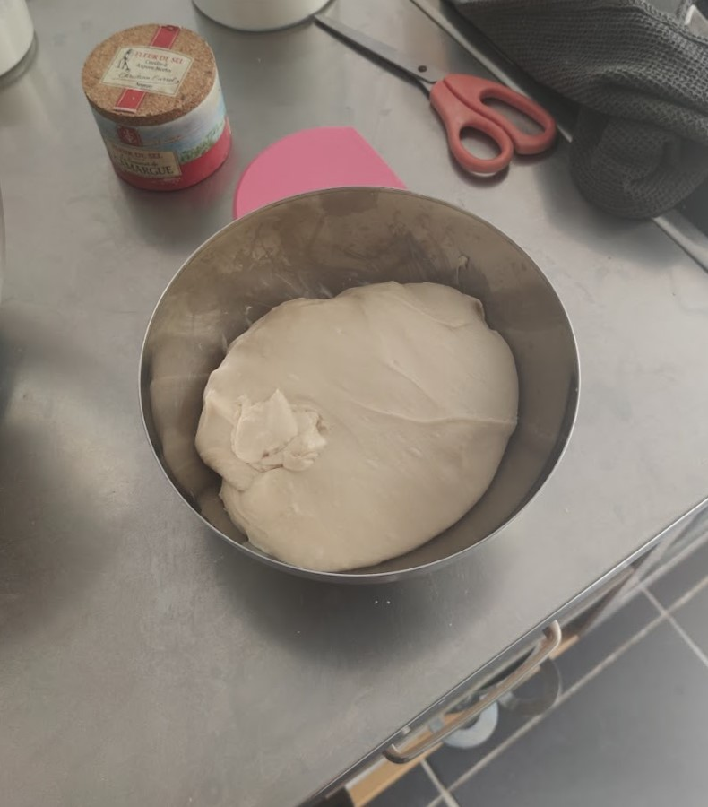
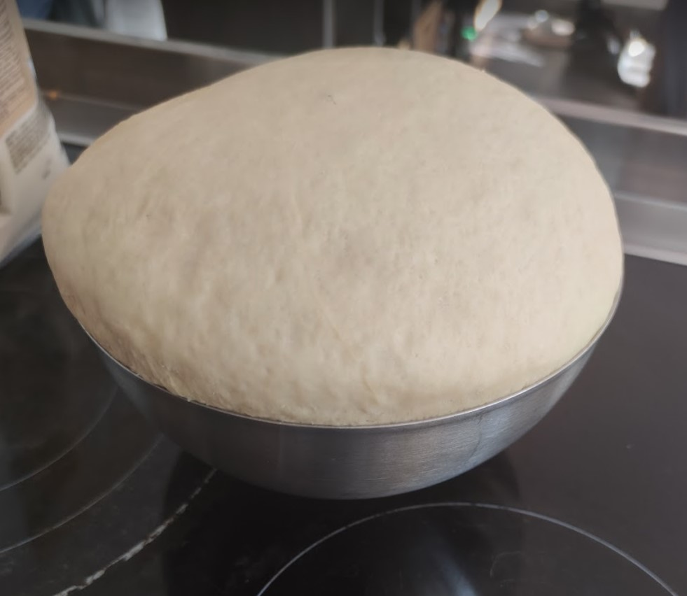
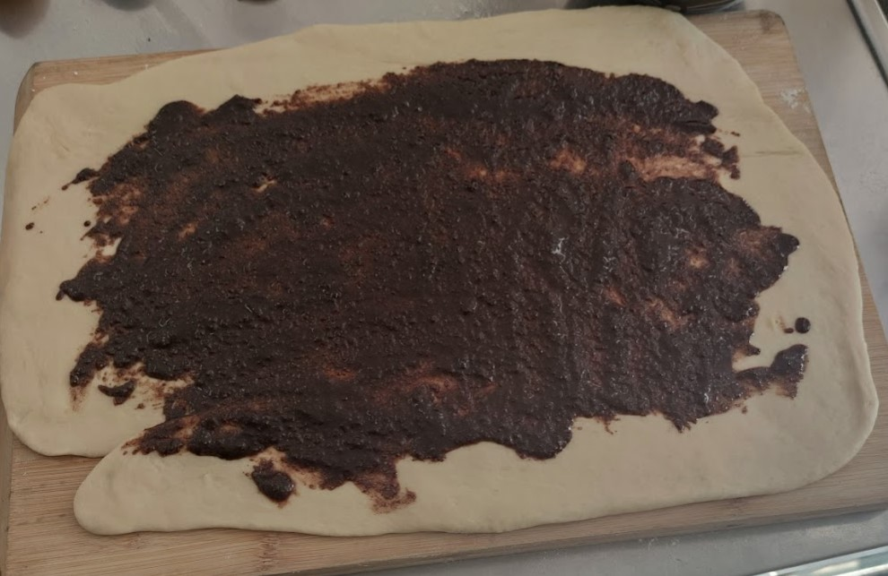
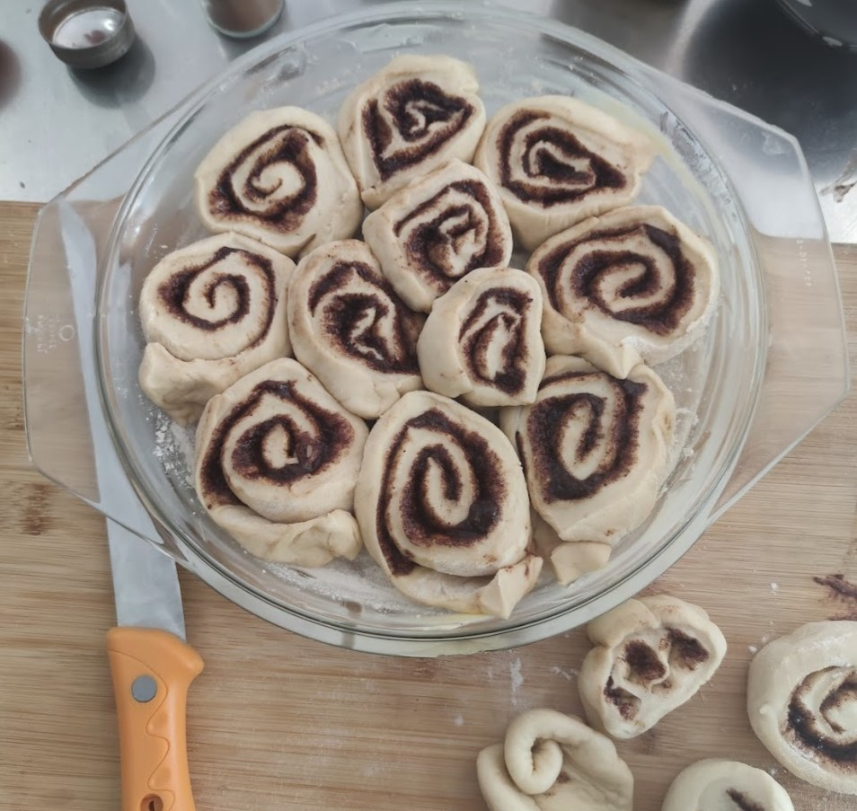
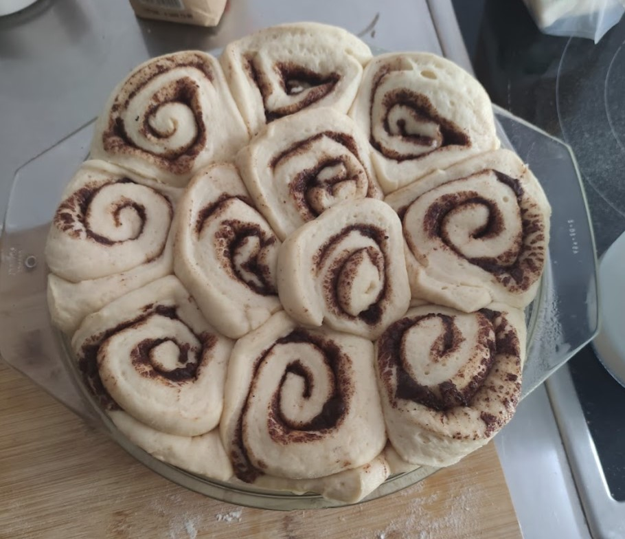
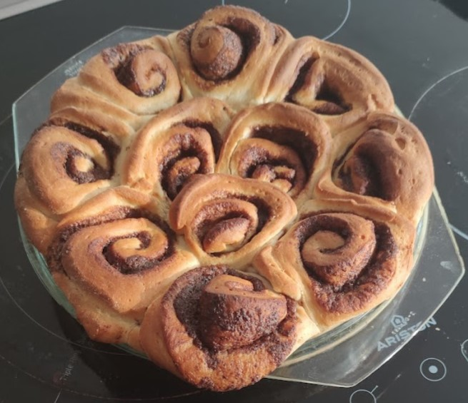
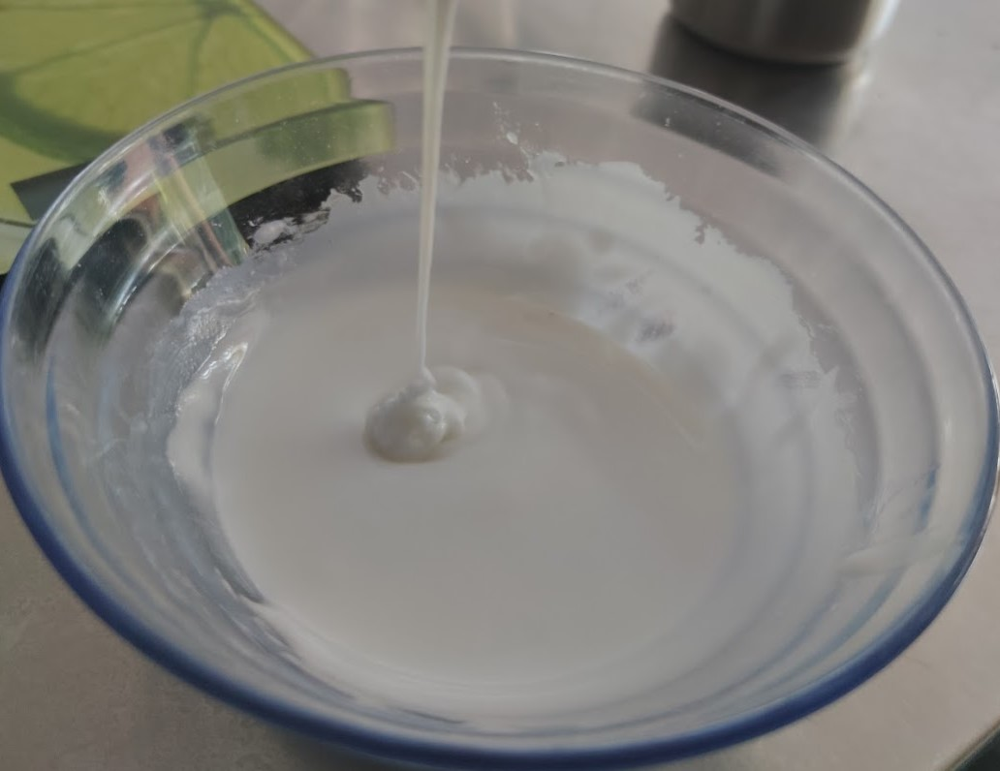
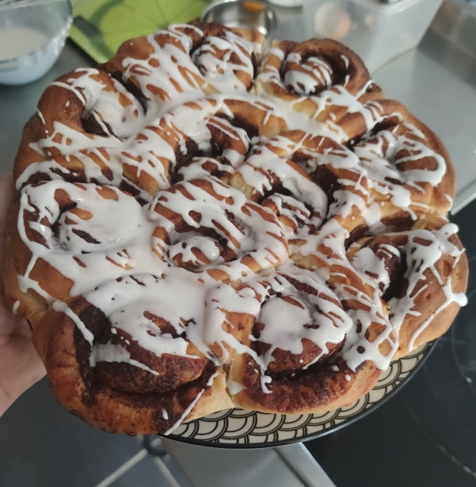

Une collègue de boulot nous fait parfois des cinnamon rolls, c'est tellement bon.
Du coup, j'me suis dit que si j'voulais en manger un peu plus souvent, fallait que je m'y essaye moi-même.

<!--more-->

## Liste des ingrédients et quantités

_Pour environ 15 rolls_

Pour le glaçage :
- 120 g de sucre glace
- 1 blanc d'oeuf

Pour la garniture à la cannelle :
- 3 cuillères à café de cannelle moulue
- 60 gr de cassonade
- 50 g de beurre fondu

Pour la pâte à brioche :
- 500 g de farine
- 25 cl de lait
- 1 sachet de levure boulangère
- 60g de sucre blanc
- 1 cuillère à café de sel
- 100 g de beurre froid
- 1 oeuf entier

## Étapes de la recette

1- Faire tiédir le lait et diluer la levure dedans.

2- On commence par la pâte à brioche. Dans un saladier mélanger la farine, le sel, le sucre et l'oeuf. Commencer à pétrir et verser le mélange lait/levure. Lorsque la masse commence à faire une pâte (~10 minutes), y ajouter le beurre froid en morceaux et continuer à pétrir (~10 minutes).

3- Mettre la pâte au repos pendant 1h30 (ça s'appelle faire "piquer" la pâte) dans un saladier couvert d'un torchon. Elle aura normalement doublé de volume.

4- En attendant, préparer la garniture à la cannelle. Mélanger le beurre fondu, la cassonade et la cannelle.

5- Dégazer la pâte en appuyant dessus, fleurer le plan de travail (c'est-à-dire mettre de la farine sur le plan de travail.) Étaler la pâte en rectangle puis étaler la garniture dessus.

6- Rouler la pâte et sa garniture en boudin et détailler en tranches. Les tranches peuvent être cuites individuellement, ou assemblées dans un grand moule à gâteau.

7- Couvrir le tout d'un torchon, mettre dans le four éteint pendant 40 minutes avec un bol d'eau bouillante. Cela va aider à faire lever la préparation dans une atmosphère humide.  

8- Retirer le tout du four, faire préchauffer à 180 °C puis enfourner 25 minutes.

9- Laisser refroidir et préparer le glaçage en mélangeant le sucre en poudre et le blanc d'oeuf. Quand le gâteau a bien refroidi, glacer en faisant des fils avec une fourchette ou un fouet.

## Photos

