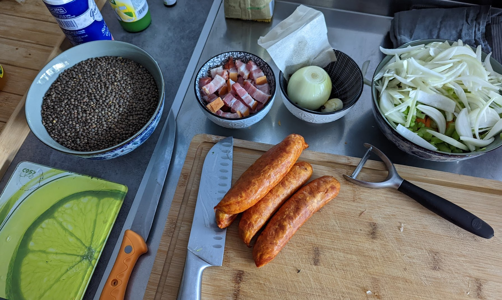
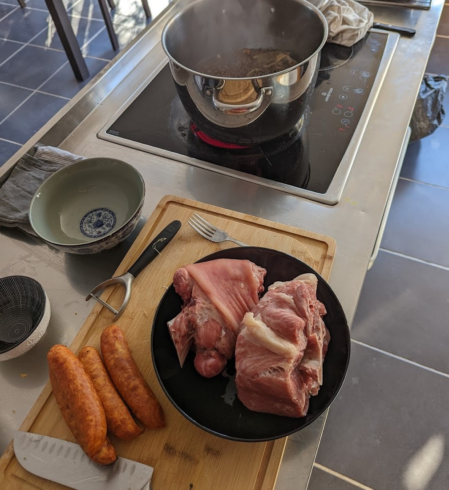
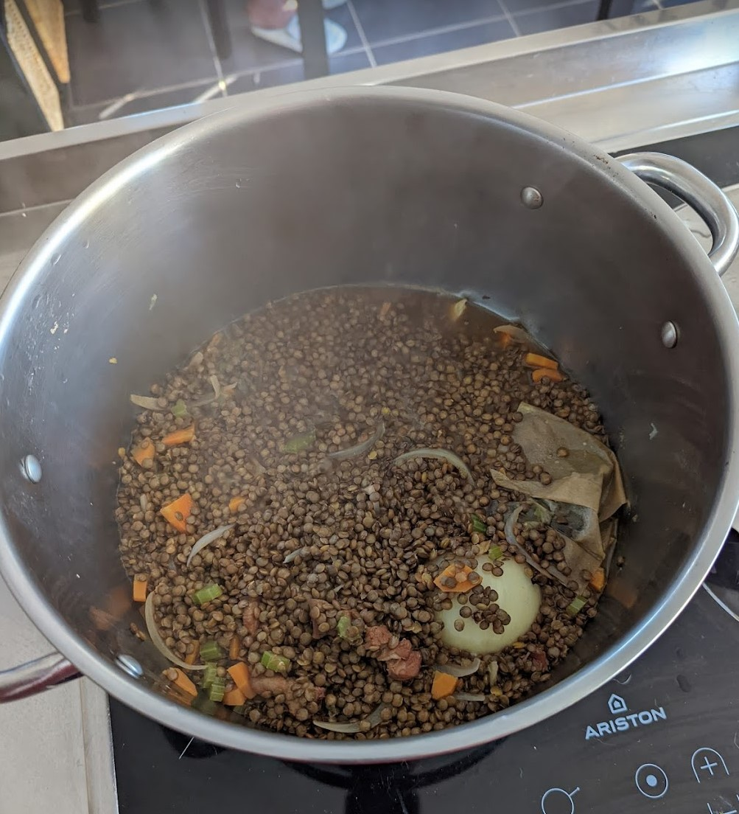
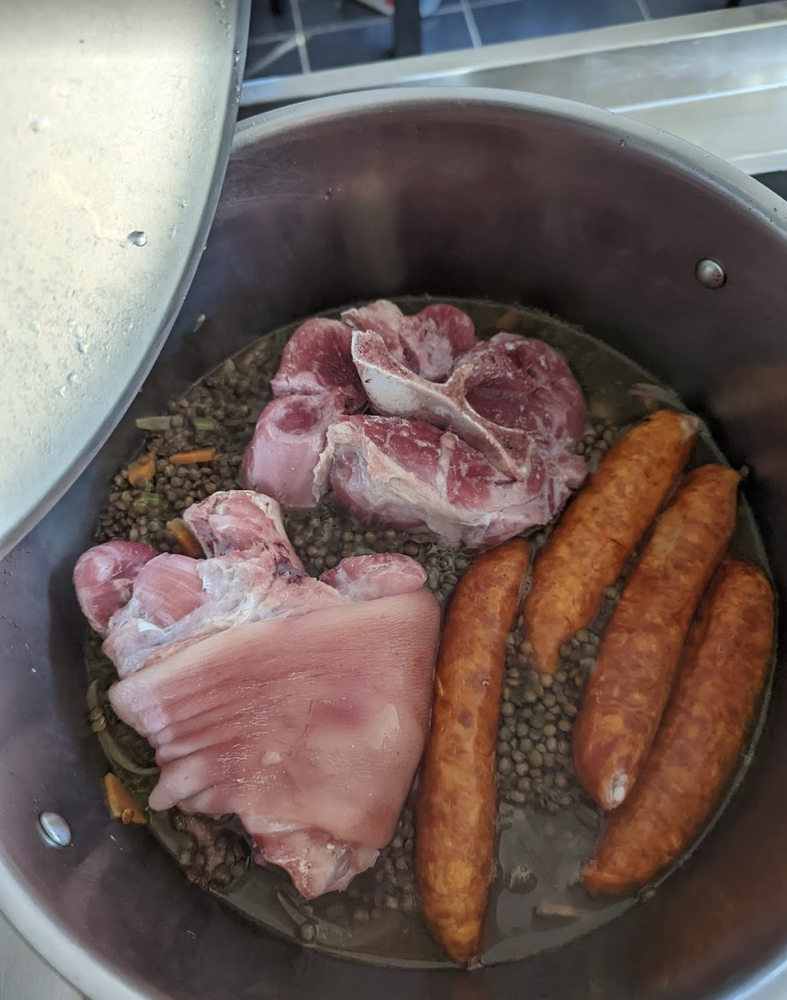
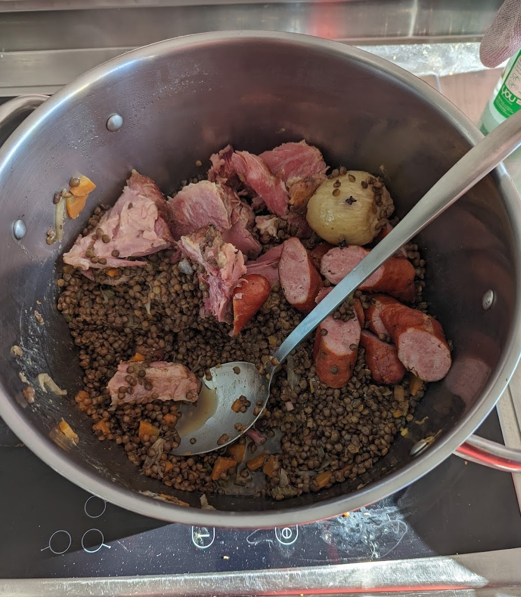

Probablement un de mes plats préféré, surtout l'hiver. Hyper réconfortant et généreux, c'est un plat qui tient au corps.

<!--more-->

## Liste des ingrédients et quantités

Pour 4 personnes

- 1 jambonneau demi sel
- 1 palette demi sel
- 4 saucisses fumées
- 500g de lentilles
- 2 oignons jaune
- Une branche de céleri
- 2 belles carottes
- 4 clous de girofle
- 2 gousses d'ail
- Huile d'olive
- 1 feuille de laurier
- 1 branche de thym

## Étapes de la recette

1- Remplir une grand casserole d'eau froide et y plonger le jambonneau et la palette demi sel. Laisser désaler pendant quelques heures. Vous pouvez vous y prendre la veille, mais sinon, une paire d'heures feront l'affaire.

2- Comme les lentilles cuisent en 30 minutes et la viande en 1h30, cuire la viande. Vider l'eau de la casserole (attention, elle doit être à la fois salée et grasse... je refilerai pas à ça à mes plantes) et remplir à nouveau. Faire cuire pendant 1h30.

3- En attendant, préparer les légumes. Émincer le premier oignon. Émincer le céleri branche. Couper les carottes en paysanne (c'est à dire en petits triangles). Clouter le deuxième oignon avant les clous de girofle (c'est à dire planter les clous dans l'oignon... dis comme ça, c'est chelou). Pour l'ail, vous pouvez le laisser en chemise (c'est à dire avec sa peau).

4- La viande a fini de cuire. La réserver dans une assiette, vider l'eau (qui elle aussi est encore grasse et salée, pas folichon pour les plantes). Rincer la casserolle, elle va reservir.

5- Mettre de l'huile d'olive dans le fond de la casserole, et faire revenir quelques minutes (3 ou 4 minutes, le temps que les oignons deviennent translucides) les carottes, céleris et oignon (pas le clouté, lui on le laisse tranquille pour le moment). Y ajouter les lentilles, remuer et laisser revenir 3 à 4 minutes. Mouiller à hauteur, rajouter l'oignon clouté et les gousses d'ail, la feuille de laurier et la branche de thym et faire cuire pendant 15 à 20 minutes à feu moyen.

6- Après 15 à 20 minutes de cuissons, les lentilles sont encore croquantes. Rajouter la viande : palette et jambonneau, mettre les saucisses et les piquer (pour éviter qu'elles explosent) et faire mijoter 30 bonnes minutes.

7- C'est prêt, on retire le thym et le laurier. Personnellement, je débite la viande, retire les os, coupe les saucisses en morceau et puis je sers ça avec un verre de pinard. Du rouge. Mais peu importe la couleur, chacun boit ce qu'il veut.

## Photos

